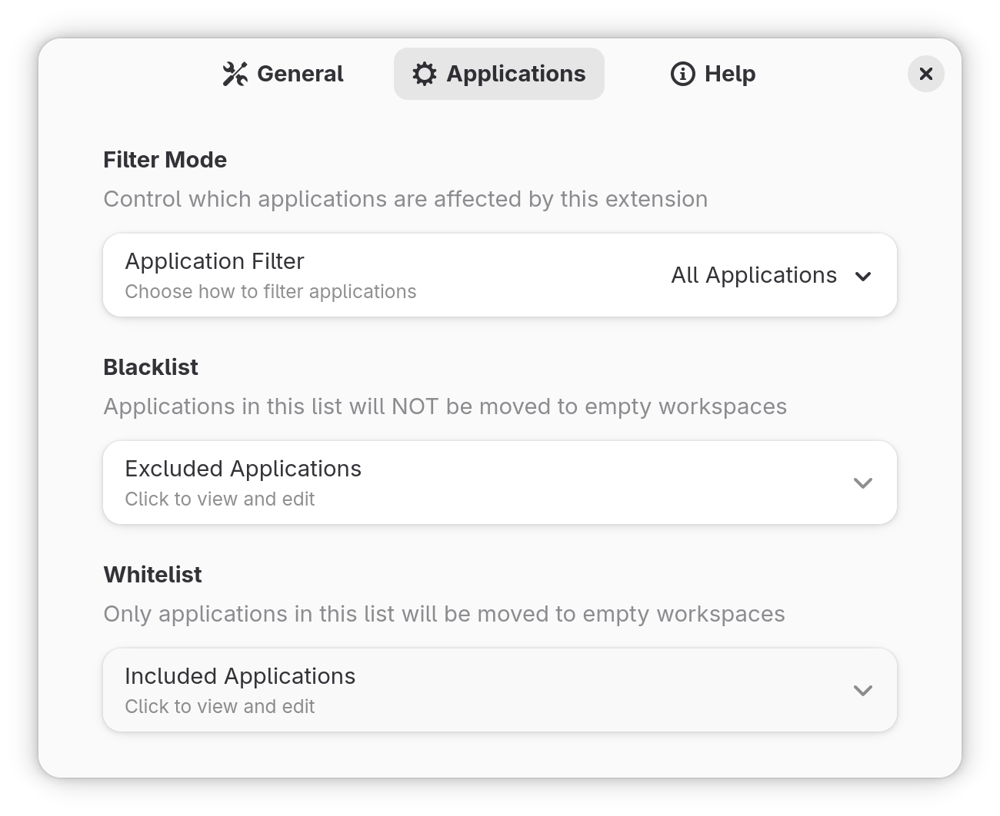

# Maximize to Workspace

A GNOME Shell extension that binds maximized windows to their own workspace.

## Features

- **Automatic workspace management**: Maximized windows are moved to the first available empty workspace
- **Restore on unmaximize/close**: Windows return to their previous workspace when unmaximized or closed
- **Quick Settings toggle**: Toggle the extension directly from the GNOME Shell quick settings panel
- **Application filtering**: Blacklist or whitelist specific applications
- **Multi-monitor support**: Works with both single and multi-monitor setups
- **Dynamic workspace support**: Compatible with GNOME's dynamic workspace feature

## Installation

### From Source

1. Clone this repository:
   ```bash
   git clone https://github.com/wroyca/maximize-to-workspace.git
   cd maximize-to-workspace
   ```

2. Make the install script executable:
   ```bash
   chmod +x install.sh
   ```

3. Run the install script:
   ```bash
   ./install.sh
   ```

## Usage

### Quick Settings Toggle

After installation, you'll find a "Maximize to Workspace" toggle in the GNOME Shell quick settings panel (click the system menu in the top-right corner). Use this toggle to quickly enable or disable the extension.


### Preferences

Open the extension preferences to configure:

1. Through GNOME Extensions app:
   ```bash
   gnome-extensions prefs maximize-to-workspace@wroyca
   ```

2. Or through the Extensions app GUI



### Configuration Options

#### General Settings

- **Move on Maximize**: When enabled, windows are moved to empty workspaces when maximized (not just fullscreen)
- **Restore on Close**: When enabled, closing a maximized window returns you to the previous workspace
- **Create Workspace at End**: When enabled (default), new workspaces are created as the last workspace in the list. When disabled, workspaces are created next to the current workspace

#### Application Filtering

Choose one of three filter modes:

1. **All Applications** (default): All windows are affected by the extension
2. **Blacklist (Exclude)**: Only windows NOT in the blacklist are affected
3. **Whitelist (Include Only)**: Only windows in the whitelist are affected

## Contributing

Contributions are welcome! Please feel free to submit issues or pull requests.

## Credits

Inspired by the [fullscreen-to-new-workspace](https://github.com/onsah/fullscreen-to-new-workspace) extension by onsah.

## License

This extension is licensed under the GNU General Public License v3.0 or later (GPL-3.0-or-later).
